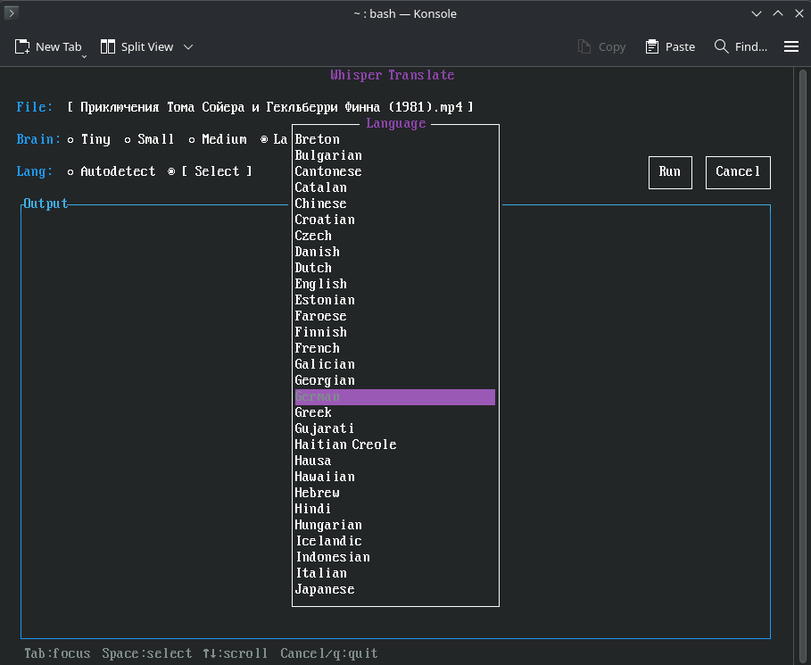

# Whisper Translate

A terminal UI for transcribing and translating video files into SRT subtitles using [OpenAI Whisper](https://github.com/openai/whisper).

## Purpose

Foreign-language video content is everywhere — films, lectures, interviews — but subtitles aren't always available. This tool exists to make that barrier disappear with a single command. Drop in any video file, pick a model (brain), and walk away; Whisper Translate handles the conversion, transcription, and translation entirely locally, with no cloud accounts, no API keys, and no internet connection required after the first setup. The result is a ready-to-use `.srt` subtitle file saved right alongside your video.



---

## Features

- **Interactive curses TUI** — keyboard and mouse driven, no flags to remember
- **File picker** — browse your filesystem, filtered to video files only
- **5 model sizes** — Tiny, Small, Medium, Turbo (default), Large
- **Language control** — autodetect or pick from 100+ languages
- **ffmpeg progress bar** — real-time conversion progress with percentage
- **Live whisper output** — scrollable log of whisper's transcription output
- **Clean cancellation** — Cancel button or `q` terminates the job and cleans up temp files

---

## Requirements

| Dependency | Install |
|---|---|
| Python 3 | `sudo pacman -S python` / `sudo apt install python3` |
| ffmpeg + ffprobe | `sudo pacman -S ffmpeg` / `sudo apt install ffmpeg` |

The first run automatically creates a Python virtual environment and installs `openai-whisper` into it. No manual setup needed.

---

## Usage

```bash
./translate.sh
```

Navigate with **Tab** / **arrow keys** / **mouse**:

| Area | Action |
|---|---|
| **File** | Click or Space/Enter to open the file picker |
| **Brain** | Select Whisper model size (left/right arrows or click) |
| **Lang** | Autodetect, or choose a specific source language |
| **Run** | Start transcription (only active once a file is selected) |
| **Cancel / q** | Cancel a running job, or quit when idle |

The SRT file is saved in the same directory as the source video.

---

## Model Guide

| Model | VRAM | Speed | Quality |
|---|---|---|---|
| Tiny | ~1 GB | Fastest | Basic |
| Small | ~2 GB | Fast | Good |
| Medium | ~5 GB | Moderate | Better |
| **Turbo** *(default)* | ~6 GB | Fast | Near-large |
| Large | ~10 GB | Slow | Best |

Turbo is the recommended default — it offers near-large quality at roughly 8× the speed.

---

## How It Works

1. `ffprobe` reads the video duration (for progress reporting)
2. `ffmpeg` converts the video to a 16 kHz mono WAV
3. `whisper` transcribes and translates the WAV to English SRT
4. The WAV is deleted; the SRT is saved alongside the source file

---

## Supported Video Formats

`.mp4` `.mkv` `.avi` `.mov` `.wmv` `.flv` `.webm` `.m4v` `.ts` `.mpg` `.mpeg`

---

## License

MIT
